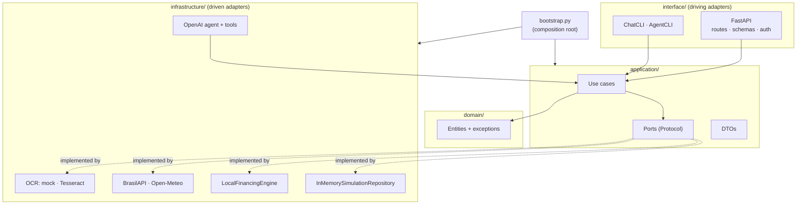
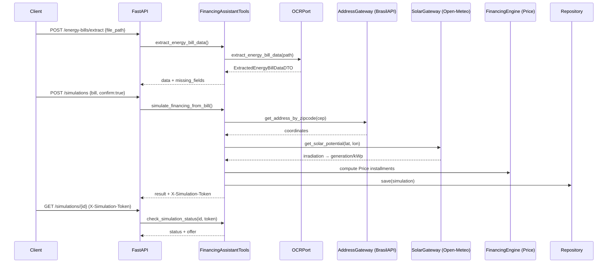

# Architecture

Solar Financing Assistant is built with a **hexagonal architecture (Ports & Adapters)**.
The goal is a domain that knows nothing about HTTP, OCR engines, HTTP clients, or the
OpenAI SDK, so that any of those can be swapped without touching business rules.

## Layers

```
domain/          Entities and exceptions. Zero external dependencies.
application/     Use cases, DTOs, and ports (Protocol contracts).
infrastructure/  Concrete adapters: OCR, HTTP gateways, financing engine, repository, LLM.
interface/       Delivery mechanisms: FastAPI HTTP API and terminal CLIs.
config/          Settings loaded from environment variables via pydantic-settings.
bootstrap.py     Composition root — wires adapters into use cases.
```

### Dependency rule

Dependencies point **inward only**:



- `domain` imports nothing from the other layers (no FastAPI, no httpx, no OpenAI).
- `application` depends only on `domain` and its own port `Protocol`s.
- `infrastructure` implements the ports; it is the only layer that touches the network,
  the filesystem, or third-party SDKs.
- `interface` translates transport concerns (HTTP requests, terminal input) into use-case
  calls and never contains business logic.

Because use cases depend on `Protocol` contracts rather than concrete classes, replacing
`MockOCRAdapter` with `TesseractOCRAdapter` (or a future OpenAI Vision adapter) changes a
single line in the composition root and no use case at all.

## Request flow — end-to-end simulation



If the bill has no zip code, the address lookup fails, or the solar API is unreachable,
the pipeline falls back to `GENERATION_PER_KWP_MONTH` and tags the result with
`solar_potential_source = "fallback"` plus a warning, so consumers can tell estimated
data from measured data.

## Key design decisions

| Decision | Rationale |
|----------|-----------|
| **Hexagonal architecture** | Keeps business rules isolated and independently testable; swapping adapters is a one-line change in `bootstrap.py`. |
| **Ports as `typing.Protocol`** | Structural typing means adapters don't need to inherit a base class; test fakes just match the shape. |
| **DI via FastAPI `Depends` + `AppState`** | Singletons are built once in the lifespan and stored on `app.state`; `dependency_overrides` swap them in tests with no `lru_cache` state leaking between suites. |
| **Native OpenAI tool calling (no LangChain)** | Fewer dependencies and full control over the tool-calling loop; the agent is a thin wrapper over the same use cases the HTTP API uses. |
| **Decimal for money** | Financial values use `Decimal` end-to-end to avoid binary floating-point rounding errors. |
| **In-memory repository** | Simple by design for a portfolio/demo; behind `FinancingSimulationRepositoryPort`, so a SQL adapter can be added without touching use cases. |
| **Optional agent** | The API boots without an OpenAI key and returns `503` only on `/agent/chat`, so the core simulation flow never depends on a paid third party. |
| **Explicit resource shutdown** | Gateways hold `httpx.AsyncClient`s; the composition root registers them as closeables and the lifespan closes them on shutdown to avoid connection leaks. |

## Security model

| Vector | Mitigation |
|--------|-----------|
| Unauthorized access | Optional `X-API-Key` (`APIKeyHeader`) enforced on every route; compared with `secrets.compare_digest` to avoid timing leaks. Disabled by default for local dev (`api_key = None`). |
| Endpoint abuse | Per-client rate limiting via `slowapi`, keyed on `X-Forwarded-For` (first hop) so limits are per real client behind a reverse proxy. |
| Path traversal | A Pydantic validator rejects `..`; the route additionally requires the resolved path to be inside `UPLOAD_DIR` (`Path.is_relative_to`). |
| Prompt injection | System prompt marks OCR-extracted text as data, never instructions; the `system` role is blocked in the request schema; the first message must be `user`; content is capped at 4,000 chars; OCR data is wrapped in explicit delimiters. |
| Data leakage | CPF is masked in every response; raw OCR text is never returned by the agent endpoint. |
| Simulation ownership | A per-simulation access token is returned in the `X-Simulation-Token` header (never in the body) and required to read the simulation back. |
| Unbounded memory growth | Both the repository and the token store are bounded with FIFO eviction at the same capacity, so a token never outlives (or is orphaned from) its simulation. |

## Testing strategy

- **Unit tests** (`tests/unit/`) cover domain entities, all use cases, adapters, the OCR
  parser, the financing engine, tool schemas, and agent dispatch — fully offline.
- **Integration tests** (`tests/integration/`, marked `@pytest.mark.integration`) exercise
  the FastAPI app end-to-end, the CLI journey, and the live external gateways.
- Type safety is enforced project-wide with `mypy --strict`; lint and formatting with
  `ruff`. All three run in CI.
